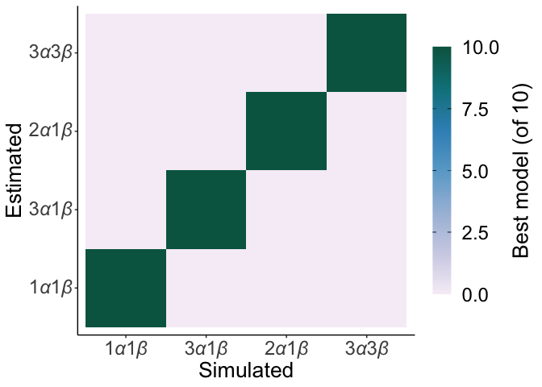
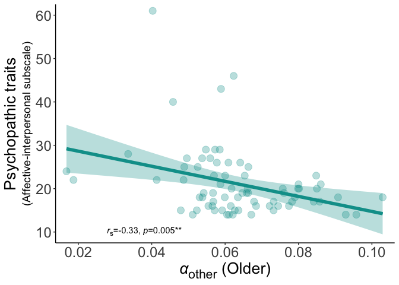

## Set up and functions

## General settings

## Plots of model identifiability, parameter recovery & model fit

<!-- --><!-- --><!-- --><!-- --><!-- -->

## Compare model fit between groups

## Trial-by-trial analysis and plot (checking learning):

<!-- -->

## Model predicting choices across conditions

## Analysis of RL parameters from model with 3 alphas, 1 beta

## Model of alpha

<table class="table" style="margin-left: auto; margin-right: auto;">
<caption>Robust linear mixed model for learning rates</caption>
 <thead>
  <tr>
   <th style="text-align:left;">   </th>
   <th style="text-align:center;"> beta </th>
   <th style="text-align:center;"> 2.5 % </th>
   <th style="text-align:center;"> 97.5 % </th>
   <th style="text-align:center;"> SE </th>
   <th style="text-align:center;"> z </th>
   <th style="text-align:center;"> p </th>
  </tr>
 </thead>
<tbody>
  <tr>
   <td style="text-align:left;"> Intercept </td>
   <td style="text-align:center;"> 0.090 </td>
   <td style="text-align:center;"> 0.083 </td>
   <td style="text-align:center;"> 0.097 </td>
   <td style="text-align:center;"> 0.004 </td>
   <td style="text-align:center;"> 25.45 </td>
   <td style="text-align:center;"> &lt;0.001 </td>
  </tr>
  <tr>
   <td style="text-align:left;"> Agent (other vs self) </td>
   <td style="text-align:center;"> -0.024 </td>
   <td style="text-align:center;"> -0.034 </td>
   <td style="text-align:center;"> -0.014 </td>
   <td style="text-align:center;"> 0.005 </td>
   <td style="text-align:center;"> -4.79 </td>
   <td style="text-align:center;"> &lt;0.001 </td>
  </tr>
  <tr>
   <td style="text-align:left;"> Agent (no one vs self) </td>
   <td style="text-align:center;"> -0.023 </td>
   <td style="text-align:center;"> -0.033 </td>
   <td style="text-align:center;"> -0.013 </td>
   <td style="text-align:center;"> 0.005 </td>
   <td style="text-align:center;"> -4.57 </td>
   <td style="text-align:center;"> &lt;0.001 </td>
  </tr>
  <tr>
   <td style="text-align:left;"> Group (older vs younger) </td>
   <td style="text-align:center;"> -0.019 </td>
   <td style="text-align:center;"> -0.028 </td>
   <td style="text-align:center;"> -0.009 </td>
   <td style="text-align:center;"> 0.005 </td>
   <td style="text-align:center;"> -3.73 </td>
   <td style="text-align:center;"> &lt;0.001 </td>
  </tr>
  <tr>
   <td style="text-align:left;"> Group * agent (other vs self) </td>
   <td style="text-align:center;"> 0.016 </td>
   <td style="text-align:center;"> 0.002 </td>
   <td style="text-align:center;"> 0.030 </td>
   <td style="text-align:center;"> 0.007 </td>
   <td style="text-align:center;"> 2.29 </td>
   <td style="text-align:center;"> 0.022 </td>
  </tr>
  <tr>
   <td style="text-align:left;"> Group * agent (no one vs self) </td>
   <td style="text-align:center;"> 0.008 </td>
   <td style="text-align:center;"> -0.006 </td>
   <td style="text-align:center;"> 0.022 </td>
   <td style="text-align:center;"> 0.007 </td>
   <td style="text-align:center;"> 1.15 </td>
   <td style="text-align:center;"> 0.25 </td>
  </tr>
</tbody>
</table>

## Post hocs

## Wilcoxon signed rank test on self, other and noone parameters for each group separately

<table class="table" style="margin-left: auto; margin-right: auto;">
<caption>Differences between groups in learning rate for each agent</caption>
 <thead>
  <tr>
   <th style="text-align:left;"> Group </th>
   <th style="text-align:center;"> Young mean </th>
   <th style="text-align:center;"> Young SD </th>
   <th style="text-align:center;"> Older mean </th>
   <th style="text-align:center;"> Older SD </th>
   <th style="text-align:center;"> z </th>
   <th style="text-align:center;"> p </th>
  </tr>
 </thead>
<tbody>
  <tr>
   <td style="text-align:left;"> Self </td>
   <td style="text-align:center;"> 0.102 </td>
   <td style="text-align:center;"> 0.058 </td>
   <td style="text-align:center;"> 0.081 </td>
   <td style="text-align:center;"> 0.050 </td>
   <td style="text-align:center;"> -2.63 </td>
   <td style="text-align:center;"> 0.009 </td>
  </tr>
  <tr>
   <td style="text-align:left;"> Other </td>
   <td style="text-align:center;"> 0.066 </td>
   <td style="text-align:center;"> 0.018 </td>
   <td style="text-align:center;"> 0.063 </td>
   <td style="text-align:center;"> 0.015 </td>
   <td style="text-align:center;"> -0.86 </td>
   <td style="text-align:center;"> 0.39 </td>
  </tr>
  <tr>
   <td style="text-align:left;"> No one </td>
   <td style="text-align:center;"> 0.073 </td>
   <td style="text-align:center;"> 0.045 </td>
   <td style="text-align:center;"> 0.060 </td>
   <td style="text-align:center;"> 0.034 </td>
   <td style="text-align:center;"> -1.61 </td>
   <td style="text-align:center;"> 0.11 </td>
  </tr>
</tbody>
</table>

<table class="table" style="margin-left: auto; margin-right: auto;">
<caption>Differences between agents in learning rate for each group</caption>
 <thead>
  <tr>
   <th style="text-align:left;"> Comparison </th>
   <th style="text-align:center;"> Young z </th>
   <th style="text-align:center;"> Young p </th>
   <th style="text-align:center;"> Older z </th>
   <th style="text-align:center;"> Older p </th>
  </tr>
 </thead>
<tbody>
  <tr>
   <td style="text-align:left;"> Self vs. other </td>
   <td style="text-align:center;"> -4.04 </td>
   <td style="text-align:center;"> &lt;0.001 </td>
   <td style="text-align:center;"> -1.4 </td>
   <td style="text-align:center;"> 0.15 </td>
  </tr>
  <tr>
   <td style="text-align:left;"> Self vs. no one </td>
   <td style="text-align:center;"> -2.62 </td>
   <td style="text-align:center;"> 0.009 </td>
   <td style="text-align:center;"> -2.8 </td>
   <td style="text-align:center;"> 0.006 </td>
  </tr>
  <tr>
   <td style="text-align:left;"> Other vs. no one </td>
   <td style="text-align:center;"> -0.57 </td>
   <td style="text-align:center;"> 0.57 </td>
   <td style="text-align:center;"> -2.4 </td>
   <td style="text-align:center;"> 0.018 </td>
  </tr>
</tbody>
</table>

## Differences between young and old on psychopathy

<table class="table" style="margin-left: auto; margin-right: auto;">
<caption>Differences between groups in trait measures</caption>
 <thead>
  <tr>
   <th style="text-align:left;"> Questionnaire: </th>
   <th style="text-align:center;"> Young mean (s.d) </th>
   <th style="text-align:center;"> Older mean (s.d) </th>
   <th style="text-align:center;"> Z </th>
   <th style="text-align:center;"> p </th>
  </tr>
 </thead>
<tbody>
  <tr>
   <td style="text-align:left;"> SRP affective interpersonal </td>
   <td style="text-align:center;"> 24.36 (8.09) </td>
   <td style="text-align:center;"> 21.09 (7.88) </td>
   <td style="text-align:center;"> -3.1 </td>
   <td style="text-align:center;"> 0.002 </td>
  </tr>
  <tr>
   <td style="text-align:left;"> SRP lifestyle antisocial </td>
   <td style="text-align:center;"> 22.89 (6.84) </td>
   <td style="text-align:center;"> 20.27 (5.62) </td>
   <td style="text-align:center;"> -2.8 </td>
   <td style="text-align:center;"> 0.005 </td>
  </tr>
</tbody>
</table>

## Correlations between traits and learning parameters

<table class="table" style="margin-left: auto; margin-right: auto;">
<caption>Correlations between alphas and affective interpersonal</caption>
 <thead>
  <tr>
   <th style="text-align:left;"> Group </th>
   <th style="text-align:left;"> Agent </th>
   <th style="text-align:right;"> r </th>
   <th style="text-align:right;"> p </th>
  </tr>
 </thead>
<tbody>
  <tr>
   <td style="text-align:left;"> Young </td>
   <td style="text-align:left;"> Self </td>
   <td style="text-align:right;"> -0.02 </td>
   <td style="text-align:right;"> 0.85 </td>
  </tr>
  <tr>
   <td style="text-align:left;"> Young </td>
   <td style="text-align:left;"> Other </td>
   <td style="text-align:right;"> 0.21 </td>
   <td style="text-align:right;"> 0.07 </td>
  </tr>
  <tr>
   <td style="text-align:left;"> Young </td>
   <td style="text-align:left;"> No one </td>
   <td style="text-align:right;"> -0.13 </td>
   <td style="text-align:right;"> 0.27 </td>
  </tr>
  <tr>
   <td style="text-align:left;"> Young </td>
   <td style="text-align:left;"> Other - self </td>
   <td style="text-align:right;"> 0.11 </td>
   <td style="text-align:right;"> 0.36 </td>
  </tr>
  <tr>
   <td style="text-align:left;"> Older </td>
   <td style="text-align:left;"> Self </td>
   <td style="text-align:right;"> 0.17 </td>
   <td style="text-align:right;"> 0.16 </td>
  </tr>
  <tr>
   <td style="text-align:left;"> Older </td>
   <td style="text-align:left;"> Other </td>
   <td style="text-align:right;"> -0.33 </td>
   <td style="text-align:right;"> 0.00 </td>
  </tr>
  <tr>
   <td style="text-align:left;"> Older </td>
   <td style="text-align:left;"> No one </td>
   <td style="text-align:right;"> -0.01 </td>
   <td style="text-align:right;"> 0.94 </td>
  </tr>
  <tr>
   <td style="text-align:left;"> Older </td>
   <td style="text-align:left;"> Other - self </td>
   <td style="text-align:right;"> -0.25 </td>
   <td style="text-align:right;"> 0.03 </td>
  </tr>
</tbody>
</table>

## Plots of main effects

<!-- --><!-- -->

## Plots of correlations

<!-- --><!-- --><!-- --><!-- -->
