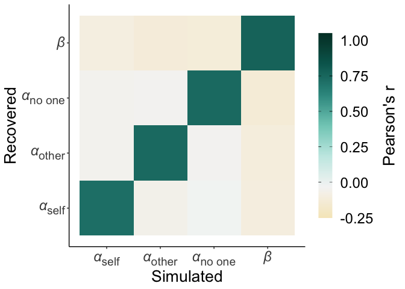
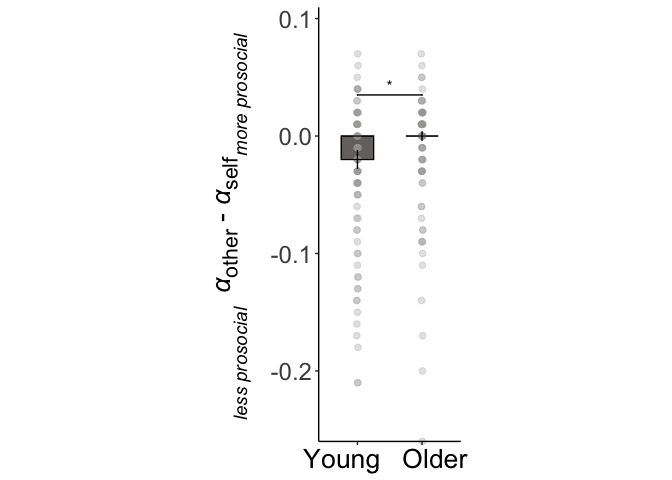
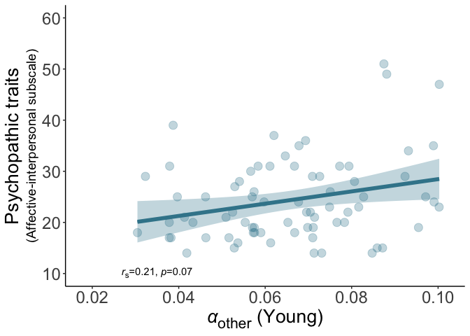
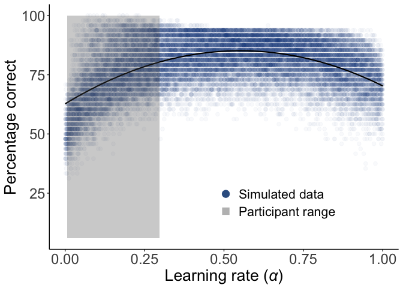
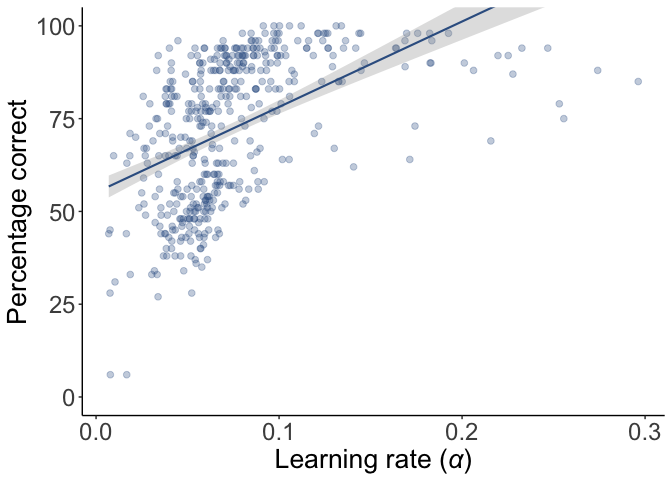

## Plots of model identifiability, parameter recovery & model fit

<!-- --><!-- --><!-- --><!-- --><!-- -->

## Trial-by-trial plot

<!-- -->

## Model predicting choices across conditions

<table class="table" style="margin-left: auto; margin-right: auto;">
<caption>Robust linear mixed model for choice performance</caption>
 <thead>
  <tr>
   <th style="text-align:left;">   </th>
   <th style="text-align:center;"> beta </th>
   <th style="text-align:center;"> 2.5 % </th>
   <th style="text-align:center;"> 97.5 % </th>
   <th style="text-align:center;"> SE </th>
   <th style="text-align:center;"> z </th>
   <th style="text-align:center;"> p </th>
  </tr>
 </thead>
<tbody>
  <tr>
   <td style="text-align:left;"> Intercept </td>
   <td style="text-align:center;"> 2.300 </td>
   <td style="text-align:center;"> 1.908 </td>
   <td style="text-align:center;"> 2.608 </td>
   <td style="text-align:center;"> 0.180 </td>
   <td style="text-align:center;"> 12.65 </td>
   <td style="text-align:center;"> &lt;0.001 </td>
  </tr>
  <tr>
   <td style="text-align:left;"> Trial number </td>
   <td style="text-align:center;"> 1.700 </td>
   <td style="text-align:center;"> 1.292 </td>
   <td style="text-align:center;"> 2.134 </td>
   <td style="text-align:center;"> 0.210 </td>
   <td style="text-align:center;"> 7.97 </td>
   <td style="text-align:center;"> &lt;0.001 </td>
  </tr>
  <tr>
   <td style="text-align:left;"> Agent (other vs self) </td>
   <td style="text-align:center;"> -0.220 </td>
   <td style="text-align:center;"> -0.492 </td>
   <td style="text-align:center;"> 0.045 </td>
   <td style="text-align:center;"> 0.140 </td>
   <td style="text-align:center;"> -1.63 </td>
   <td style="text-align:center;"> 0.10 </td>
  </tr>
  <tr>
   <td style="text-align:left;"> Agent (no one vs self) </td>
   <td style="text-align:center;"> -0.360 </td>
   <td style="text-align:center;"> -0.675 </td>
   <td style="text-align:center;"> -0.051 </td>
   <td style="text-align:center;"> 0.160 </td>
   <td style="text-align:center;"> -2.28 </td>
   <td style="text-align:center;"> 0.023 </td>
  </tr>
  <tr>
   <td style="text-align:left;"> Group (older vs younger) </td>
   <td style="text-align:center;"> -1.200 </td>
   <td style="text-align:center;"> -1.652 </td>
   <td style="text-align:center;"> -0.700 </td>
   <td style="text-align:center;"> 0.240 </td>
   <td style="text-align:center;"> -4.84 </td>
   <td style="text-align:center;"> &lt;0.001 </td>
  </tr>
  <tr>
   <td style="text-align:left;"> Trial number * agent (other vs self) </td>
   <td style="text-align:center;"> 0.270 </td>
   <td style="text-align:center;"> -0.165 </td>
   <td style="text-align:center;"> 0.710 </td>
   <td style="text-align:center;"> 0.220 </td>
   <td style="text-align:center;"> 1.22 </td>
   <td style="text-align:center;"> 0.22 </td>
  </tr>
  <tr>
   <td style="text-align:left;"> Trial number * agent (no one vs self) </td>
   <td style="text-align:center;"> 0.089 </td>
   <td style="text-align:center;"> -0.370 </td>
   <td style="text-align:center;"> 0.549 </td>
   <td style="text-align:center;"> 0.230 </td>
   <td style="text-align:center;"> 0.38 </td>
   <td style="text-align:center;"> 0.70 </td>
  </tr>
  <tr>
   <td style="text-align:left;"> Trial number * group </td>
   <td style="text-align:center;"> -0.810 </td>
   <td style="text-align:center;"> -1.340 </td>
   <td style="text-align:center;"> -0.270 </td>
   <td style="text-align:center;"> 0.270 </td>
   <td style="text-align:center;"> -2.95 </td>
   <td style="text-align:center;"> 0.003 </td>
  </tr>
  <tr>
   <td style="text-align:left;"> Group * agent (other vs self) </td>
   <td style="text-align:center;"> 0.160 </td>
   <td style="text-align:center;"> -0.166 </td>
   <td style="text-align:center;"> 0.484 </td>
   <td style="text-align:center;"> 0.170 </td>
   <td style="text-align:center;"> 0.96 </td>
   <td style="text-align:center;"> 0.34 </td>
  </tr>
  <tr>
   <td style="text-align:left;"> Group * agent (no one vs self) </td>
   <td style="text-align:center;"> 0.160 </td>
   <td style="text-align:center;"> -0.241 </td>
   <td style="text-align:center;"> 0.552 </td>
   <td style="text-align:center;"> 0.200 </td>
   <td style="text-align:center;"> 0.77 </td>
   <td style="text-align:center;"> 0.44 </td>
  </tr>
  <tr>
   <td style="text-align:left;"> Trial number * group * agent (other vs self) </td>
   <td style="text-align:center;"> -0.007 </td>
   <td style="text-align:center;"> -0.504 </td>
   <td style="text-align:center;"> 0.489 </td>
   <td style="text-align:center;"> 0.250 </td>
   <td style="text-align:center;"> -0.03 </td>
   <td style="text-align:center;"> 0.98 </td>
  </tr>
  <tr>
   <td style="text-align:left;"> Trial number * group * agent (no one vs self) </td>
   <td style="text-align:center;"> -0.040 </td>
   <td style="text-align:center;"> -0.580 </td>
   <td style="text-align:center;"> 0.499 </td>
   <td style="text-align:center;"> 0.280 </td>
   <td style="text-align:center;"> -0.15 </td>
   <td style="text-align:center;"> 0.88 </td>
  </tr>
</tbody>
</table>


## Model of alpha

<table class="table" style="margin-left: auto; margin-right: auto;">
<caption>Robust linear mixed model for learning rates</caption>
 <thead>
  <tr>
   <th style="text-align:left;">   </th>
   <th style="text-align:center;"> beta </th>
   <th style="text-align:center;"> 2.5 % </th>
   <th style="text-align:center;"> 97.5 % </th>
   <th style="text-align:center;"> SE </th>
   <th style="text-align:center;"> z </th>
   <th style="text-align:center;"> p </th>
  </tr>
 </thead>
<tbody>
  <tr>
   <td style="text-align:left;"> Intercept </td>
   <td style="text-align:center;"> 0.090 </td>
   <td style="text-align:center;"> 0.083 </td>
   <td style="text-align:center;"> 0.097 </td>
   <td style="text-align:center;"> 0.004 </td>
   <td style="text-align:center;"> 25.45 </td>
   <td style="text-align:center;"> &lt;0.001 </td>
  </tr>
  <tr>
   <td style="text-align:left;"> Agent (other vs self) </td>
   <td style="text-align:center;"> -0.024 </td>
   <td style="text-align:center;"> -0.034 </td>
   <td style="text-align:center;"> -0.014 </td>
   <td style="text-align:center;"> 0.005 </td>
   <td style="text-align:center;"> -4.79 </td>
   <td style="text-align:center;"> &lt;0.001 </td>
  </tr>
  <tr>
   <td style="text-align:left;"> Agent (no one vs self) </td>
   <td style="text-align:center;"> -0.023 </td>
   <td style="text-align:center;"> -0.033 </td>
   <td style="text-align:center;"> -0.013 </td>
   <td style="text-align:center;"> 0.005 </td>
   <td style="text-align:center;"> -4.57 </td>
   <td style="text-align:center;"> &lt;0.001 </td>
  </tr>
  <tr>
   <td style="text-align:left;"> Group (older vs younger) </td>
   <td style="text-align:center;"> -0.019 </td>
   <td style="text-align:center;"> -0.028 </td>
   <td style="text-align:center;"> -0.009 </td>
   <td style="text-align:center;"> 0.005 </td>
   <td style="text-align:center;"> -3.73 </td>
   <td style="text-align:center;"> &lt;0.001 </td>
  </tr>
  <tr>
   <td style="text-align:left;"> Group * agent (other vs self) </td>
   <td style="text-align:center;"> 0.016 </td>
   <td style="text-align:center;"> 0.002 </td>
   <td style="text-align:center;"> 0.030 </td>
   <td style="text-align:center;"> 0.007 </td>
   <td style="text-align:center;"> 2.29 </td>
   <td style="text-align:center;"> 0.022 </td>
  </tr>
  <tr>
   <td style="text-align:left;"> Group * agent (no one vs self) </td>
   <td style="text-align:center;"> 0.008 </td>
   <td style="text-align:center;"> -0.006 </td>
   <td style="text-align:center;"> 0.022 </td>
   <td style="text-align:center;"> 0.007 </td>
   <td style="text-align:center;"> 1.15 </td>
   <td style="text-align:center;"> 0.25 </td>
  </tr>
</tbody>
</table>

## Between and within-group comparisons

<table class="table" style="margin-left: auto; margin-right: auto;">
<caption>Differences between groups in learning rate for each agent</caption>
 <thead>
  <tr>
   <th style="text-align:left;"> Group </th>
   <th style="text-align:center;"> Young mean </th>
   <th style="text-align:center;"> Young SD </th>
   <th style="text-align:center;"> Older mean </th>
   <th style="text-align:center;"> Older SD </th>
   <th style="text-align:center;"> z </th>
   <th style="text-align:center;"> p </th>
  </tr>
 </thead>
<tbody>
  <tr>
   <td style="text-align:left;"> Self </td>
   <td style="text-align:center;"> 0.102 </td>
   <td style="text-align:center;"> 0.058 </td>
   <td style="text-align:center;"> 0.081 </td>
   <td style="text-align:center;"> 0.050 </td>
   <td style="text-align:center;"> -2.63 </td>
   <td style="text-align:center;"> 0.009 </td>
  </tr>
  <tr>
   <td style="text-align:left;"> Other </td>
   <td style="text-align:center;"> 0.066 </td>
   <td style="text-align:center;"> 0.018 </td>
   <td style="text-align:center;"> 0.063 </td>
   <td style="text-align:center;"> 0.015 </td>
   <td style="text-align:center;"> -0.86 </td>
   <td style="text-align:center;"> 0.39 </td>
  </tr>
  <tr>
   <td style="text-align:left;"> No one </td>
   <td style="text-align:center;"> 0.073 </td>
   <td style="text-align:center;"> 0.045 </td>
   <td style="text-align:center;"> 0.060 </td>
   <td style="text-align:center;"> 0.034 </td>
   <td style="text-align:center;"> -1.61 </td>
   <td style="text-align:center;"> 0.11 </td>
  </tr>
</tbody>
</table>

<table class="table" style="margin-left: auto; margin-right: auto;">
<caption>Differences between agents in learning rate for each group</caption>
 <thead>
  <tr>
   <th style="text-align:left;"> Comparison </th>
   <th style="text-align:center;"> Young z </th>
   <th style="text-align:center;"> Young p </th>
   <th style="text-align:center;"> Older z </th>
   <th style="text-align:center;"> Older p </th>
  </tr>
 </thead>
<tbody>
  <tr>
   <td style="text-align:left;"> Self vs. other </td>
   <td style="text-align:center;"> -4.04 </td>
   <td style="text-align:center;"> &lt;0.001 </td>
   <td style="text-align:center;"> -1.4 </td>
   <td style="text-align:center;"> 0.15 </td>
  </tr>
  <tr>
   <td style="text-align:left;"> Self vs. no one </td>
   <td style="text-align:center;"> -2.62 </td>
   <td style="text-align:center;"> 0.009 </td>
   <td style="text-align:center;"> -2.8 </td>
   <td style="text-align:center;"> 0.006 </td>
  </tr>
  <tr>
   <td style="text-align:left;"> Other vs. no one </td>
   <td style="text-align:center;"> -0.57 </td>
   <td style="text-align:center;"> 0.57 </td>
   <td style="text-align:center;"> -2.4 </td>
   <td style="text-align:center;"> 0.018 </td>
  </tr>
</tbody>
</table>

## Differences between young and old on psychopathic traits

<table class="table" style="margin-left: auto; margin-right: auto;">
<caption>Differences between groups in trait measures</caption>
 <thead>
  <tr>
   <th style="text-align:left;"> Questionnaire: </th>
   <th style="text-align:center;"> Young mean (s.d) </th>
   <th style="text-align:center;"> Older mean (s.d) </th>
   <th style="text-align:center;"> Z </th>
   <th style="text-align:center;"> p </th>
  </tr>
 </thead>
<tbody>
  <tr>
   <td style="text-align:left;"> SRP affective interpersonal </td>
   <td style="text-align:center;"> 24.36 (8.09) </td>
   <td style="text-align:center;"> 21.09 (7.88) </td>
   <td style="text-align:center;"> -3.1 </td>
   <td style="text-align:center;"> 0.002 </td>
  </tr>
  <tr>
   <td style="text-align:left;"> SRP lifestyle antisocial </td>
   <td style="text-align:center;"> 22.89 (6.84) </td>
   <td style="text-align:center;"> 20.27 (5.62) </td>
   <td style="text-align:center;"> -2.8 </td>
   <td style="text-align:center;"> 0.005 </td>
  </tr>
</tbody>
</table>

## Correlations between psychopathic traits and learning parameters

<table class="table" style="margin-left: auto; margin-right: auto;">
<caption>Correlations between alphas and affective interpersonal</caption>
 <thead>
  <tr>
   <th style="text-align:left;"> Group </th>
   <th style="text-align:left;"> Agent </th>
   <th style="text-align:center;"> r </th>
   <th style="text-align:center;"> p </th>
   <th style="text-align:center;"> FDR p </th>
  </tr>
 </thead>
<tbody>
  <tr>
   <td style="text-align:left;"> Young </td>
   <td style="text-align:left;"> Self </td>
   <td style="text-align:center;"> -0.02 </td>
   <td style="text-align:center;"> 0.85 </td>
   <td style="text-align:center;"> 0.94 </td>
  </tr>
  <tr>
   <td style="text-align:left;"> Young </td>
   <td style="text-align:left;"> Other </td>
   <td style="text-align:center;"> 0.21 </td>
   <td style="text-align:center;"> 0.07 </td>
   <td style="text-align:center;"> 0.22 </td>
  </tr>
  <tr>
   <td style="text-align:left;"> Young </td>
   <td style="text-align:left;"> No one </td>
   <td style="text-align:center;"> -0.13 </td>
   <td style="text-align:center;"> 0.27 </td>
   <td style="text-align:center;"> 0.40 </td>
  </tr>
  <tr>
   <td style="text-align:left;"> Young </td>
   <td style="text-align:left;"> Other - self </td>
   <td style="text-align:center;"> 0.11 </td>
   <td style="text-align:center;"> 0.36 </td>
   <td style="text-align:center;"> NA </td>
  </tr>
  <tr>
   <td style="text-align:left;"> Older </td>
   <td style="text-align:left;"> Self </td>
   <td style="text-align:center;"> 0.17 </td>
   <td style="text-align:center;"> 0.16 </td>
   <td style="text-align:center;"> 0.31 </td>
  </tr>
  <tr>
   <td style="text-align:left;"> Older </td>
   <td style="text-align:left;"> Other </td>
   <td style="text-align:center;"> -0.33 </td>
   <td style="text-align:center;"> 0.00 </td>
   <td style="text-align:center;"> 0.03 </td>
  </tr>
  <tr>
   <td style="text-align:left;"> Older </td>
   <td style="text-align:left;"> No one </td>
   <td style="text-align:center;"> -0.01 </td>
   <td style="text-align:center;"> 0.94 </td>
   <td style="text-align:center;"> 0.94 </td>
  </tr>
  <tr>
   <td style="text-align:left;"> Older </td>
   <td style="text-align:left;"> Other - self </td>
   <td style="text-align:center;"> -0.25 </td>
   <td style="text-align:center;"> 0.03 </td>
   <td style="text-align:center;"> NA </td>
  </tr>
</tbody>
</table>


```
## Running nonparametric bootstrap
## 
## Running nonparametric bootstrap
```

## Plots of main effects

<!-- --><!-- --><!-- -->

## Plots of correlations

<!-- --><!-- -->

## Plots of simulated alphas and performance

<!-- -->

## Correlations between percentage correct and learning parameters

<!-- --><table class="table" style="margin-left: auto; margin-right: auto;">
<caption>Correlations between alphas and % correct</caption>
 <thead>
  <tr>
   <th style="text-align:left;"> Group </th>
   <th style="text-align:left;"> Agent </th>
   <th style="text-align:center;"> r </th>
   <th style="text-align:center;"> p </th>
  </tr>
 </thead>
<tbody>
  <tr>
   <td style="text-align:left;"> Young </td>
   <td style="text-align:left;"> Self </td>
   <td style="text-align:center;"> 0.46 </td>
   <td style="text-align:center;"> &lt;0.001 </td>
  </tr>
  <tr>
   <td style="text-align:left;"> Young </td>
   <td style="text-align:left;"> Other </td>
   <td style="text-align:center;"> 0.66 </td>
   <td style="text-align:center;"> &lt;0.001 </td>
  </tr>
  <tr>
   <td style="text-align:left;"> Young </td>
   <td style="text-align:left;"> No one </td>
   <td style="text-align:center;"> 0.65 </td>
   <td style="text-align:center;"> &lt;0.001 </td>
  </tr>
  <tr>
   <td style="text-align:left;"> Older </td>
   <td style="text-align:left;"> Self </td>
   <td style="text-align:center;"> 0.68 </td>
   <td style="text-align:center;"> &lt;0.001 </td>
  </tr>
  <tr>
   <td style="text-align:left;"> Older </td>
   <td style="text-align:left;"> Other </td>
   <td style="text-align:center;"> 0.66 </td>
   <td style="text-align:center;"> &lt;0.001 </td>
  </tr>
  <tr>
   <td style="text-align:left;"> Older </td>
   <td style="text-align:left;"> No one </td>
   <td style="text-align:center;"> 0.61 </td>
   <td style="text-align:center;"> &lt;0.001 </td>
  </tr>
</tbody>
</table>


## Differences between young and old on psychopathic traits excluding extreme scores

<table class="table" style="margin-left: auto; margin-right: auto;">
<caption>Differences between groups in trait measures excluding extreme scores</caption>
 <thead>
  <tr>
   <th style="text-align:left;"> Questionnaire: </th>
   <th style="text-align:center;"> Young mean (s.d) </th>
   <th style="text-align:center;"> Older mean (s.d) </th>
   <th style="text-align:center;"> Z </th>
   <th style="text-align:center;"> p </th>
  </tr>
 </thead>
<tbody>
  <tr>
   <td style="text-align:left;"> SRP affective interpersonal </td>
   <td style="text-align:center;"> 23.65 (6.95) </td>
   <td style="text-align:center;"> 20.19 (5.64) </td>
   <td style="text-align:center;"> -3.3 </td>
   <td style="text-align:center;"> 0.001 </td>
  </tr>
  <tr>
   <td style="text-align:left;"> SRP lifestyle antisocial </td>
   <td style="text-align:center;"> 22.55 (6.21) </td>
   <td style="text-align:center;"> 19.65 (4.25) </td>
   <td style="text-align:center;"> -3.0 </td>
   <td style="text-align:center;"> 0.002 </td>
  </tr>
</tbody>
</table>

## Correlations between psychopathic traits and learning parameters excluding extreme scores

<table class="table" style="margin-left: auto; margin-right: auto;">
<caption>Correlations between alphas and affective interpersonal</caption>
 <thead>
  <tr>
   <th style="text-align:left;"> Group </th>
   <th style="text-align:left;"> Agent </th>
   <th style="text-align:center;"> r </th>
   <th style="text-align:center;"> p </th>
   <th style="text-align:center;"> FDR p </th>
  </tr>
 </thead>
<tbody>
  <tr>
   <td style="text-align:left;"> Young </td>
   <td style="text-align:left;"> Self </td>
   <td style="text-align:center;"> -0.03 </td>
   <td style="text-align:center;"> 0.79 </td>
   <td style="text-align:center;"> 0.95 </td>
  </tr>
  <tr>
   <td style="text-align:left;"> Young </td>
   <td style="text-align:left;"> Other </td>
   <td style="text-align:center;"> 0.15 </td>
   <td style="text-align:center;"> 0.20 </td>
   <td style="text-align:center;"> 0.60 </td>
  </tr>
  <tr>
   <td style="text-align:left;"> Young </td>
   <td style="text-align:left;"> No one </td>
   <td style="text-align:center;"> -0.07 </td>
   <td style="text-align:center;"> 0.58 </td>
   <td style="text-align:center;"> 0.87 </td>
  </tr>
  <tr>
   <td style="text-align:left;"> Older </td>
   <td style="text-align:left;"> Self </td>
   <td style="text-align:center;"> 0.12 </td>
   <td style="text-align:center;"> 0.30 </td>
   <td style="text-align:center;"> 0.60 </td>
  </tr>
  <tr>
   <td style="text-align:left;"> Older </td>
   <td style="text-align:left;"> Other </td>
   <td style="text-align:center;"> -0.31 </td>
   <td style="text-align:center;"> 0.01 </td>
   <td style="text-align:center;"> 0.05 </td>
  </tr>
  <tr>
   <td style="text-align:left;"> Older </td>
   <td style="text-align:left;"> No one </td>
   <td style="text-align:center;"> 0.00 </td>
   <td style="text-align:center;"> 0.97 </td>
   <td style="text-align:center;"> 0.97 </td>
  </tr>
</tbody>
</table>

## Model of alpha controlling for IQ

<table class="table" style="margin-left: auto; margin-right: auto;">
<caption>Robust linear mixed model for learning rates controlling for IQ</caption>
 <thead>
  <tr>
   <th style="text-align:left;">   </th>
   <th style="text-align:center;"> beta </th>
   <th style="text-align:center;"> 2.5 % </th>
   <th style="text-align:center;"> 97.5 % </th>
   <th style="text-align:center;"> SE </th>
   <th style="text-align:center;"> z </th>
   <th style="text-align:center;"> p </th>
  </tr>
 </thead>
<tbody>
  <tr>
   <td style="text-align:left;"> Intercept </td>
   <td style="text-align:center;"> 0.100 </td>
   <td style="text-align:center;"> 0.055 </td>
   <td style="text-align:center;"> 0.145 </td>
   <td style="text-align:center;"> 0.023 </td>
   <td style="text-align:center;"> 4.35 </td>
   <td style="text-align:center;"> &lt;0.001 </td>
  </tr>
  <tr>
   <td style="text-align:left;"> General intelligence </td>
   <td style="text-align:center;"> -0.000 </td>
   <td style="text-align:center;"> -0.000 </td>
   <td style="text-align:center;"> 0.000 </td>
   <td style="text-align:center;"> 0.000 </td>
   <td style="text-align:center;"> -0.43 </td>
   <td style="text-align:center;"> 0.67 </td>
  </tr>
  <tr>
   <td style="text-align:left;"> Agent (other vs self) </td>
   <td style="text-align:center;"> -0.024 </td>
   <td style="text-align:center;"> -0.034 </td>
   <td style="text-align:center;"> -0.014 </td>
   <td style="text-align:center;"> 0.005 </td>
   <td style="text-align:center;"> -4.8 </td>
   <td style="text-align:center;"> &lt;0.001 </td>
  </tr>
  <tr>
   <td style="text-align:left;"> Agent (no one vs self) </td>
   <td style="text-align:center;"> -0.023 </td>
   <td style="text-align:center;"> -0.033 </td>
   <td style="text-align:center;"> -0.013 </td>
   <td style="text-align:center;"> 0.005 </td>
   <td style="text-align:center;"> -4.57 </td>
   <td style="text-align:center;"> &lt;0.001 </td>
  </tr>
  <tr>
   <td style="text-align:left;"> Group (older vs younger) </td>
   <td style="text-align:center;"> -0.019 </td>
   <td style="text-align:center;"> -0.028 </td>
   <td style="text-align:center;"> -0.009 </td>
   <td style="text-align:center;"> 0.005 </td>
   <td style="text-align:center;"> -3.72 </td>
   <td style="text-align:center;"> &lt;0.001 </td>
  </tr>
  <tr>
   <td style="text-align:left;"> Group * agent (other vs self) </td>
   <td style="text-align:center;"> 0.016 </td>
   <td style="text-align:center;"> 0.002 </td>
   <td style="text-align:center;"> 0.030 </td>
   <td style="text-align:center;"> 0.007 </td>
   <td style="text-align:center;"> 2.29 </td>
   <td style="text-align:center;"> 0.022 </td>
  </tr>
  <tr>
   <td style="text-align:left;"> Group * agent (no one vs self) </td>
   <td style="text-align:center;"> 0.008 </td>
   <td style="text-align:center;"> -0.006 </td>
   <td style="text-align:center;"> 0.022 </td>
   <td style="text-align:center;"> 0.007 </td>
   <td style="text-align:center;"> 1.15 </td>
   <td style="text-align:center;"> 0.25 </td>
  </tr>
</tbody>
</table>

## Correlations between learning parameters and neuropsychological measures

<table class="table" style="margin-left: auto; margin-right: auto;">
<caption>Correlations between alphas and general intelligence</caption>
 <thead>
  <tr>
   <th style="text-align:left;"> Group </th>
   <th style="text-align:left;"> Agent </th>
   <th style="text-align:center;"> r </th>
   <th style="text-align:center;"> p </th>
  </tr>
 </thead>
<tbody>
  <tr>
   <td style="text-align:left;"> Young </td>
   <td style="text-align:left;"> Self </td>
   <td style="text-align:center;"> 0.13 </td>
   <td style="text-align:center;"> 0.25 </td>
  </tr>
  <tr>
   <td style="text-align:left;"> Young </td>
   <td style="text-align:left;"> Other </td>
   <td style="text-align:center;"> -0.20 </td>
   <td style="text-align:center;"> 0.08 </td>
  </tr>
  <tr>
   <td style="text-align:left;"> Young </td>
   <td style="text-align:left;"> No one </td>
   <td style="text-align:center;"> -0.09 </td>
   <td style="text-align:center;"> 0.42 </td>
  </tr>
  <tr>
   <td style="text-align:left;"> Older </td>
   <td style="text-align:left;"> Self </td>
   <td style="text-align:center;"> -0.08 </td>
   <td style="text-align:center;"> 0.52 </td>
  </tr>
  <tr>
   <td style="text-align:left;"> Older </td>
   <td style="text-align:left;"> Other </td>
   <td style="text-align:center;"> 0.08 </td>
   <td style="text-align:center;"> 0.52 </td>
  </tr>
  <tr>
   <td style="text-align:left;"> Older </td>
   <td style="text-align:left;"> No one </td>
   <td style="text-align:center;"> 0.15 </td>
   <td style="text-align:center;"> 0.19 </td>
  </tr>
</tbody>
</table>

<table class="table" style="margin-left: auto; margin-right: auto;">
<caption>Correlations between alphas and ACE subscales</caption>
 <thead>
  <tr>
   <th style="text-align:left;"> Subscale </th>
   <th style="text-align:left;"> Agent </th>
   <th style="text-align:center;"> r </th>
   <th style="text-align:center;"> p </th>
  </tr>
 </thead>
<tbody>
  <tr>
   <td style="text-align:left;"> Memory </td>
   <td style="text-align:left;"> Self </td>
   <td style="text-align:center;"> -0.03 </td>
   <td style="text-align:center;"> 0.77 </td>
  </tr>
  <tr>
   <td style="text-align:left;"> Memory </td>
   <td style="text-align:left;"> Other </td>
   <td style="text-align:center;"> 0.00 </td>
   <td style="text-align:center;"> 0.99 </td>
  </tr>
  <tr>
   <td style="text-align:left;"> Memory </td>
   <td style="text-align:left;"> No one </td>
   <td style="text-align:center;"> 0.12 </td>
   <td style="text-align:center;"> 0.29 </td>
  </tr>
  <tr>
   <td style="text-align:left;"> Attention </td>
   <td style="text-align:left;"> Self </td>
   <td style="text-align:center;"> 0.09 </td>
   <td style="text-align:center;"> 0.47 </td>
  </tr>
  <tr>
   <td style="text-align:left;"> Attention </td>
   <td style="text-align:left;"> Other </td>
   <td style="text-align:center;"> -0.04 </td>
   <td style="text-align:center;"> 0.71 </td>
  </tr>
  <tr>
   <td style="text-align:left;"> Attention </td>
   <td style="text-align:left;"> No one </td>
   <td style="text-align:center;"> 0.20 </td>
   <td style="text-align:center;"> 0.08 </td>
  </tr>
</tbody>
</table>
